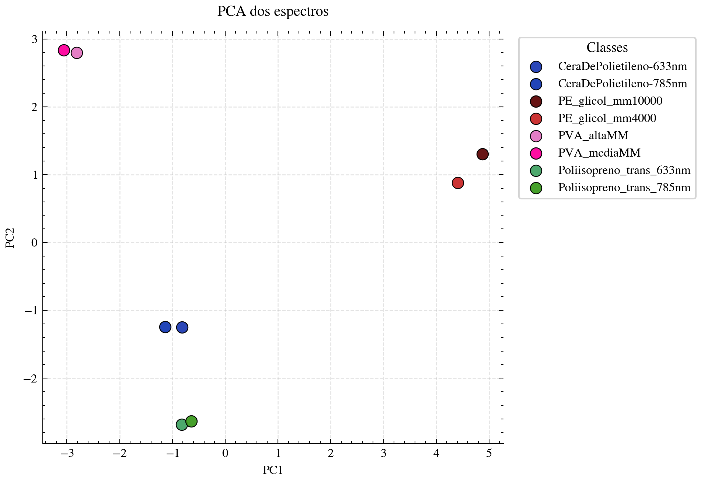

# Vetorização de espectros de Raman

Este projeto fornece um pipeline completo para download, pré-processamento, visualização e análise de espectros Raman utilizando a API pública do Ramanbase.

Os espectros utilizados neste repositório foram coletados experimentalmente por mim na Universidade Federal do Ceará (UFC), sendo acessados através da plataforma Ramanbase:

https://ramanbase.org/

---

# Descrição das Pastas

## `data`

Armazena os espectros Raman originais baixados diretamente do Ramanbase dentro de `data/raw`. Também contém os espectros processados dentro de `data/processed`. Além das figuras dentro de `data/figures`.

---

## `notebooks`

Dentro de `01_spectra_visualization.ipynb`, temos a comparação dos plots antes e depois do pré-processamento. Já dentro de `02_spectra_pca.ipynb`, temos o plot do resultado do PCA da vetorização dos espectros.

---

## `scripts`

Contém scripts executáveis. O primeiro é o `download_spectra.py`, o qual é responsável por baixas os espectros e metadadis do Ramanbase. Já o segundo é o `run_preprocessing.py` que executa o pré-processamento dos espectros baixados.

---

## `scripts/configs`

Contém arquivos YAML de configuração.

#### `spectra_ids.yaml`

Define os espectros que serão baixados.

Exemplo:

```yaml
- id: 161779
  name: Poliisopreno_trans_633nm
```

#### `preprocessing.yaml`

Define os parâmetros de pré-processamento.

Exemplo:

```yaml
x_start: 200.0
x_end: 2000.0

lam: 1000000.0
p: 0.01
```

Parâmetros:

- `x_start` → Início do deslocamento Raman
- `x_end` → Final do deslocamento Raman
- `lam` → Parâmetro de suavização do ASLS
- `p` → Parâmetro de assimetria do ASLS

---

# Token da API Ramanbase

Crie um arquivo `.env` na raiz do projeto:

```env
RAMAN_API_TOKEN=seu_token_aqui
```

O token pode ser gerado em:

https://ramanbase.org/account/tokens

---

# Executando o Pipeline

## 1. Configure os IDs dos espectros

Edite:

```text
scripts/configs/spectra_ids.yaml
```

Exemplo:

```yaml
- id: 161779
  name: Poliisopreno_trans_633nm
```

---

## 2. Baixe os espectros

Execute:

```bash
python -m scripts/download_spectra.py
```

Os espectros serão armazenados em:

```text
data/raw/
```

---

## 3. Configure o pré-processamento

Edite:

```text
scripts/configs/preprocessing.yaml
```

Exemplo:

```yaml
x_start: 200.0
x_end: 2000.0

lam: 1000000.0
p: 0.01
```

---

## 4. Execute o pré-processamento

```bash
python -m scripts/run_preprocessing.py
```

Os espectros processados serão salvos em:

```text
data/processed/
```

---

# Discussão da Análise PCA

O notebook de PCA projeta os espectros Raman em um espaço de menor dimensionalidade utilizando Principal Component Analysis (PCA).

O gráfico gerado demonstra uma separação clara entre diferentes classes de polímeros, indicando que o pipeline de pré-processamento preserva informações espectrais relevantes e permite uma boa discriminação entre os materiais analisados.

Além disso, observe como o resultado é coerente com a teoria. O espectro de Raman é resultado quase que unica e exclusivamente da natureza das ligações do polímero. Por isso, é esperado que nem o comprimento de onda do laser, nem a massa molecular do polímero interfiram muito no espectro coletado.

Exemplo da projeção PCA:

